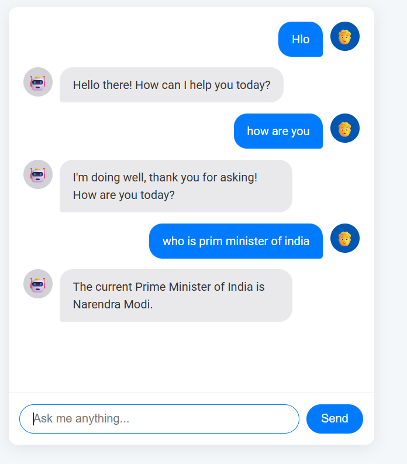

# AI Chatbot Project 🤖

This is a web-based AI chatbot application built with Python, Flask, and the Google Gemini API. It features a modern user interface, remembers conversation history, and includes user-friendly controls.

## Features ✨

* **Real-time Conversation:** Chat with a powerful AI model in a clean web interface.
* **Chat History:** The AI remembers the context of the conversation for follow-up questions.
* **Modern UI:** A sleek, responsive user interface with distinct chat bubbles.
* **Text-to-Speech:** Listen to the AI's responses aloud.
* **Copy to Clipboard:** Easily copy the AI's messages with a single click.

## Screenshot


*(To add a screenshot, take a picture of your running application, save it as `screenshot.png` in your project folder, and it will appear here.)*

## How to Run This Project Locally

Follow these steps to get the application running on your own machine.

### Prerequisites

* Python 3.8+
* An API key from [Google AI Studio](https://aistudio.google.com/)

### 1. Clone the Repository
Clone this project to your local machine.
```bash
git clone [https://github.com/your-username/ai-chatbot.git](https://github.com/your-username/ai-chatbot.git)
cd ai-chatbot
```

### 2. Create a Virtual Environment
Create and activate a virtual environment.
```bash
# For Windows
python -m venv venv
.\venv\Scripts\activate

# For macOS/Linux
python3 -m venv venv
source venv/bin/activate
```

### 3. Install Dependencies
Install the required Python libraries from the `requirements.txt` file.
```bash
pip install -r requirements.txt
```

### 4. Set Up Your API Key
In the `app.py` file, find this line and replace the placeholder with your own Google AI API key:
```python
genai.configure(api_key="your-google-api-key-here")
```

### 5. Run the Server
Start the Flask backend server.
```bash
python app.py
```
The server will be running at `http://127.0.0.1:5000`.

### 6. Launch the Frontend
Open the `index.html` file in your web browser to start chatting!